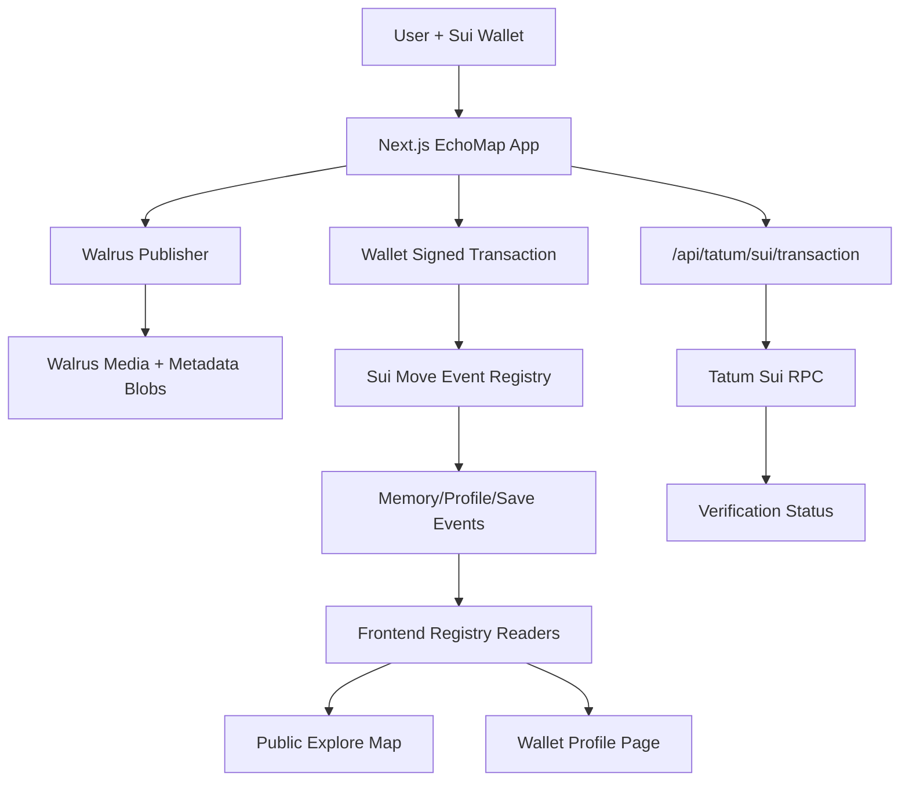
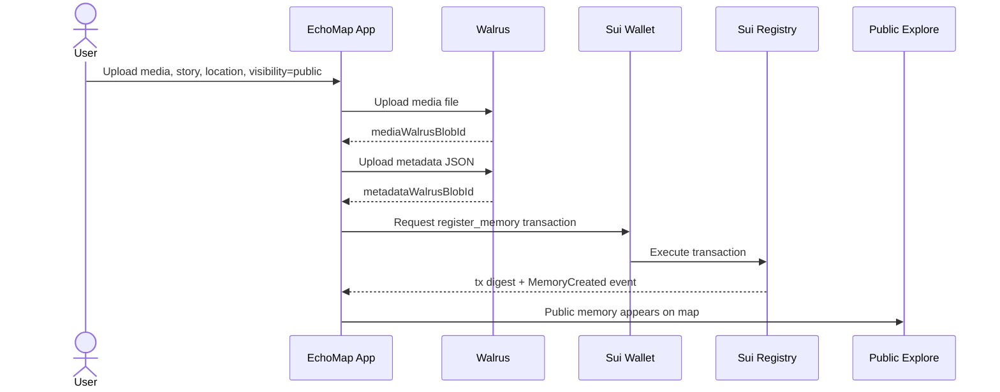
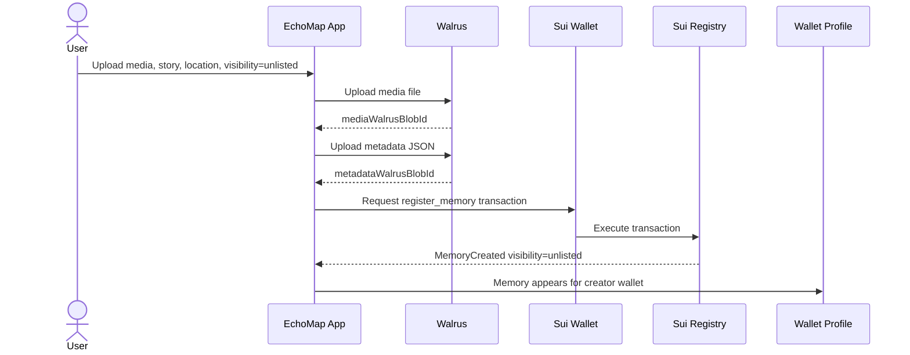
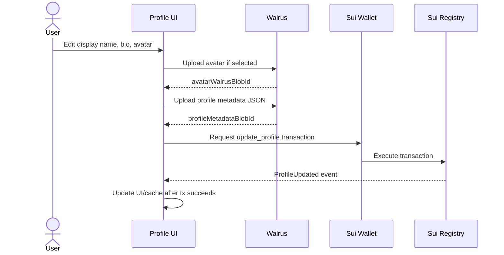
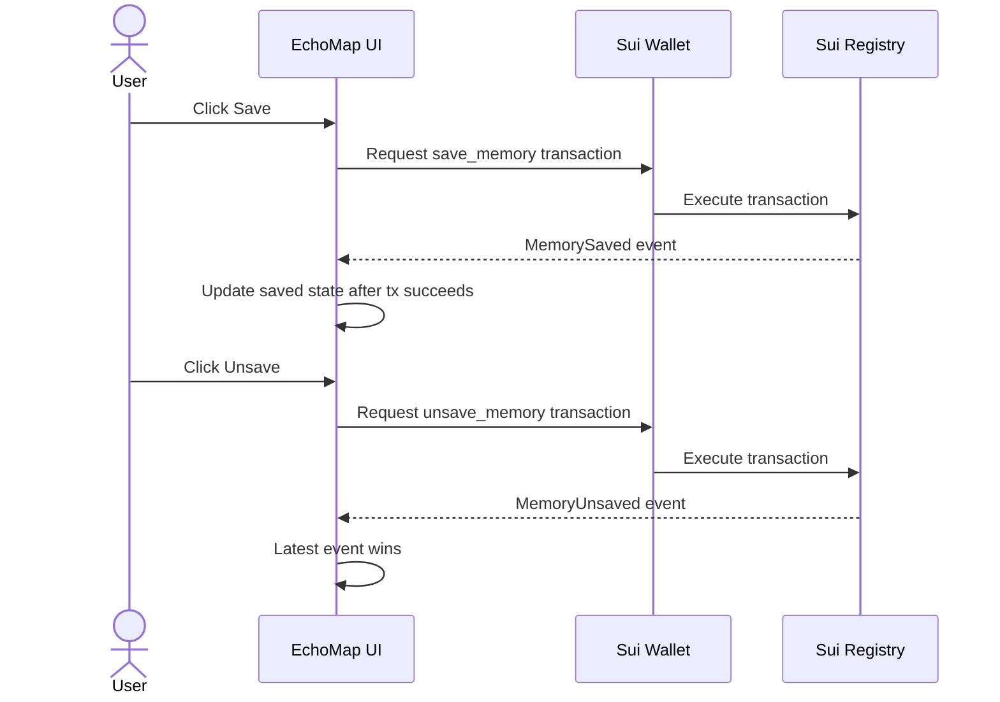
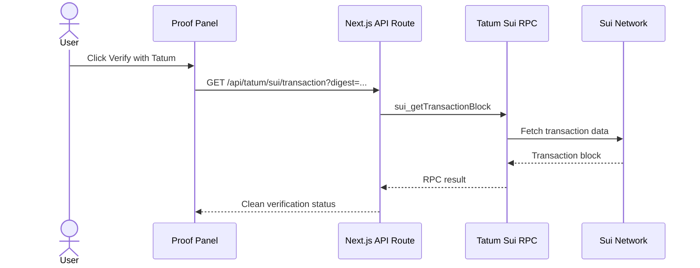

# EchoMap Architecture

EchoMap is a wallet-linked memory archive built around three durable layers:

- **Walrus** stores media and JSON metadata.
- **Sui Move registry** emits public events for memories, profiles, saves, and unsaves.
- **Tatum** verifies Sui transaction digests from a server-side API route.

The frontend treats Sui registry events as the source of truth. Browser cache is only used after successful on-chain sync and never as a production fallback.

## High-Level Architecture

## Public Memory Upload Flow

Public memories appear on:

- Landing featured sections
- `/explore`
- public map pins
- creator public memory counts

## Unlisted Memory Upload Flow

Unlisted memories are not encrypted or private. They are stored on Walrus and linked to the uploader wallet, but hidden from public Explore and Landing.

## Profile Sync Flow

If the Sui transaction fails, the profile is not saved and browser cache is not updated.

## Saved Memory Flow

Saved state is reconstructed from `MemorySaved` and `MemoryUnsaved` events. The latest event per metadata blob determines whether the memory is saved.

## Tatum Verification Flow

Tatum is called server-side to avoid browser CORS issues and to keep API keys out of public client code.

